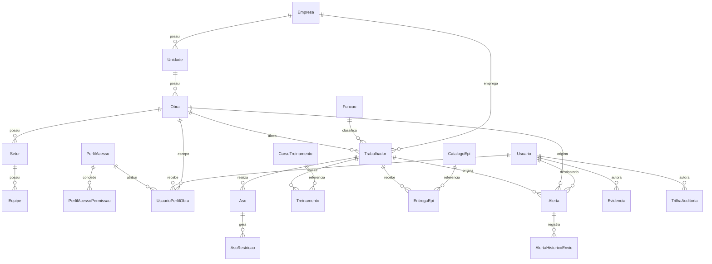

# ERD — App de SST AAHBRANT (Fase A/B — esqueleto de dados)

> Gerado a partir do schema efetivamente implementado em `src/AAHBRANT.SST.Domain/Entidades` e
> `src/AAHBRANT.SST.Infrastructure/Persistencia/Configuracoes`, e da migration
> `20260819_InitialCreate` (`src/AAHBRANT.SST.Infrastructure/Persistencia/Migrations`).
> Reflete o estado do código nesta data — não é um desenho conceitual à parte do código.

## Convenções

- Toda entidade herda `AuditableEntity` (`Id`, `CreatedAtUtc/By`, `UpdatedAtUtc/By`, `Origem`, `Ativo`, `RowVersion`).
- **Soft-delete obrigatório**: nenhuma entidade sofre `DELETE` físico. `SstDbContext.SaveChanges(Async)`
  intercepta `EntityState.Deleted` e converte em `Ativo = false` (ver `Persistencia/SstDbContext.cs`).
- Toda entidade (exceto `TrilhaAuditoria`, que é append-only) tem `HasQueryFilter(x => x.Ativo)` — registros
  desativados somem automaticamente de qualquer consulta EF Core sem precisar de `.Where` manual.
- `Origem` (enum `OrigemRegistro`): `Manual | Importacao | Ocr | IntegracaoGraph` — de onde veio o registro.

## Diagrama (núcleo implementado)



## Núcleo organizacional

| Entidade | Campos-chave | Observações |
|---|---|---|
| `Empresa` | RazaoSocial, NomeFantasia, Cnpj (único) | Raiz da hierarquia |
| `Unidade` | pertence a `Empresa` | Agrupa múltiplas obras |
| `Obra` | Codigo, Nome, Cliente, `StatusObra`, datas de início/previsão/término real, Endereco/Cidade/Uf | pertence a `Unidade` |
| `Setor` | pertence a `Obra` | |
| `Equipe` | pertence a `Setor` | |
| `Funcao` | Nome, CboCodigo, Descricao | catálogo, não pertence a obra específica |
| `Trabalhador` | Nome, Matricula, **Cpf** (índice único; alvo de Always Encrypted — Fase B), `TipoVinculo`, DataAdmissao/Demissao | pertence a `Empresa`, `Funcao`; opcionalmente a `Obra`/`Setor`/`Equipe` |

## Acesso (RBAC)

| Entidade | Campos-chave | Observações |
|---|---|---|
| `PerfilAcesso` | os 12 perfis (`TipoPerfilAcesso`) | ver `docs/RBAC-Matrix.md` |
| `PerfilAcessoPermissao` | Perfil × Módulo × Ação | esqueleto para a matriz detalhada |
| `Usuario` | AzureAdObjectId, vínculo opcional com `Trabalhador` | identidade ligada ao Entra ID |
| `UsuarioPerfilObra` | Usuario × PerfilAcesso × Obra | resolve **escopo por obra dentro da aplicação** — um usuário pode ter perfis diferentes em obras diferentes; o `roles` do JWT do Entra ID só resolve o perfil, não o escopo |

## Conformidade de pessoas (Fase B)

| Entidade | Campos-chave | Observações |
|---|---|---|
| `Aso` | TrabalhadorId, TipoExameAso, DataExame, DataValidade, `ResultadoAso` | índice em `(TrabalhadorId, DataValidade)` para o job de vencimento |
| `AsoRestricao` | AsoId, Descricao | 1:N a partir de `Aso` |
| `CursoTreinamento` | catálogo (Nome) | |
| `Treinamento` | TrabalhadorId, CursoTreinamentoId, DataValidade | índice em `(TrabalhadorId, DataValidade)` |
| `CatalogoEpi` | Nome, CertificadoAprovacaoNumero (CA) | catálogo |
| `EntregaEpi` | TrabalhadorId, CatalogoEpiId | |
| `Alerta` | 14 `TipoAlerta`, `SeveridadeAlerta`, `StatusAlerta`, TrabalhadorId?, ObraId?, DestinatarioUsuarioId, **DataLimiteTratamento/EscalonadoParaUsuarioId/DataEscalonamento** | campos de escalonamento automático já prontos (recomendação da Análise de Oportunidades) |
| `AlertaHistoricoEnvio` | AlertaId, Canal | alimenta a fila de retry do Service Bus (Fase C) |
| `Evidencia` | **EntidadeTipo/EntidadeId polimórfico**, BlobUrl, HashSha256, AutorUsuarioId, Latitude/Longitude | genérica — reutilizada por Aso/Treinamento/EntregaEpi e módulos futuros em vez de campo de anexo por módulo |
| `TrilhaAuditoria` | Timestamp, UsuarioId (**opcional** — ver nota), Acao, EntidadeTipo/Id, DadosAntes/DepoisJson, HashRegistroAnterior/Atual | **append-only**: sem `HasQueryFilter`, sem Update/Delete exposto na Application. `UsuarioId` é `Guid?` (não required) — decisão tomada para que o registro de auditoria sobreviva à desativação (`Ativo=false`) do usuário autor, evitando o problema de "relação obrigatória filtrada" que o EF Core acusaria com FK `Guid` não-nula apontando para uma entidade com `HasQueryFilter(Ativo)` |

## Pendente (fora desta fatia, esqueleto ainda não criado)

Riscos/Inventário, PGR, APR, Permissão de Trabalho (PT), Máquina/Equipamento, Inspeção/Checklist,
Não Conformidade/Plano de Ação, Acidente, Terceiro (cadastro formal), Documento de Gestão,
Requisito Legal/Matriz Legal, Auditoria (programa) — cada um entra como sua própria fatia vertical
nas fases seguintes, reaproveitando `IEligibilityService` e `Evidencia`.

## Motor de elegibilidade (§45)

Contrato definido em `src/AAHBRANT.SST.Domain/Interfaces/IEligibilityService.cs` (interface apenas —
implementação concreta das regras é Fase B):

```csharp
public interface IEligibilityService {
    Task<EligibilityResult> AvaliarAsync(EligibilityRequest request, CancellationToken ct);
}
```

Estratégia: uma `IEligibilityRule` por tipo de requisito (ASO válido, Treinamento válido, Autorização
válida, etc.), reaproveitada por qualquer módulo futuro que precise bloquear atividade.
