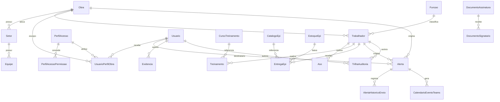

# ERD — App de SST AAHBRANT

> Gerado originalmente a partir do esqueleto inicial (`20260819_InitialCreate`) e **atualizado em
> 2026-08-28** para refletir o schema atual (~40 migrations depois, 17 módulos implementados — ver
> `ONBOARDING.md` §4). Continua não sendo um desenho conceitual à parte do código: qualquer
> divergência encontrada deve ser resolvida a favor do código (`src/AAHBRANT.SST.Domain/Entidades`,
> `src/AAHBRANT.SST.Infrastructure/Persistencia/Configuracoes`), não deste documento. Este ERD
> prioriza precisão sobre completude de campos — para o schema exato de um módulo, ler a entidade
> e a `IEntityTypeConfiguration` correspondentes.
>
> **Mudança estrutural relevante desde a versão anterior**: a hierarquia `Empresa → Unidade → Obra`
> foi removida (migration `20260820202034_RemoverEmpresaUnidade`) — `Obra` é hoje a raiz
> organizacional, sem `Empresa`/`Unidade` acima dela (ver `Núcleo organizacional` abaixo).

## Convenções

- Toda entidade herda `AuditableEntity` (`Id`, `CreatedAtUtc/By`, `UpdatedAtUtc/By`, `Origem`, `Ativo`, `RowVersion`).
- **Soft-delete obrigatório**: nenhuma entidade sofre `DELETE` físico. `SstDbContext.SaveChanges(Async)`
  intercepta `EntityState.Deleted` e converte em `Ativo = false` (ver `Persistencia/SstDbContext.cs`).
- Toda entidade (exceto `TrilhaAuditoria`, que é append-only) tem `HasQueryFilter(x => x.Ativo)` — registros
  desativados somem automaticamente de qualquer consulta EF Core sem precisar de `.Where` manual.
- `Origem` (enum `OrigemRegistro`): `Manual | Importacao | Ocr | IntegracaoGraph` — de onde veio o registro.

## Diagrama (núcleo organizacional + pessoas)

> Cobre só o núcleo — organização, RBAC e o que pendura direto do `Trabalhador`. Os outros ~14
> módulos (Riscos, PGR, PCMSO, APR, PT, Inspeções, DDS, Identificação, Ativos, Não Conformidades,
> Acidentes, Matriz Legal, Gestão Documental, Motor de Assinatura) têm suas próprias entidades
> (ver tabela "Módulos" abaixo) e não estão neste diagrama — um ERD único com todos os módulos
> ficaria ilegível e não é mantido; consultar `Entidades/<Modulo>` diretamente quando precisar do
> desenho exato de um módulo específico.



## Núcleo organizacional

`Obra` é a raiz — **não há mais `Empresa`/`Unidade`** acima dela (removidas em 20/08, migration
`RemoverEmpresaUnidade`; `Obra.Cliente` guarda o nome da empresa contratante como texto livre).

| Entidade | Campos-chave | Observações |
|---|---|---|
| `Obra` | Codigo, Nome, Cliente, **Cnpj**, **LogoConteudo/LogoContentType**, `StatusObra`, datas de início/previsão/término real, Endereco/Cidade/Uf, `MetodosAutenticacaoHabilitados` | raiz organizacional; Cnpj/Logo entraram com a ficha de EPI reformulada (27/08), aparecem no cabeçalho de documentos gerados |
| `Setor` | pertence a `Obra` | |
| `Equipe` | pertence a `Setor` | tem `EquipesController` (CRUD completo) |
| `Funcao` | Nome, CboCodigo, Descricao | catálogo, não pertence a obra específica |
| `Trabalhador` | Nome, Matricula, **Cpf** (criptografado — ver nota LGPD abaixo), `Rg`, `Turno`, `TipoVinculo`, DataAdmissao/Demissao, campos de assinatura (`PinHash`, `TermoAceiteAssinaturaEletronicaEm`, `ConsentimentoBiometriaEm`) | pertence a `Obra` (obrigatório) e `Funcao` (obrigatório); opcionalmente a `Setor`/`Equipe` |

**LGPD/CPF**: **não** foi implementado "Always Encrypted" (como uma versão anterior deste documento
previa) — em vez disso, criptografia em nível de aplicação: `CpfCriptografiaConversor` (AES-256-GCM
via `ValueConverter` do EF Core) cifra o valor armazenado, e `Trabalhador.CpfHash` (HMAC-SHA256
determinístico) preserva a unicidade via índice sem permitir recuperar o CPF a partir do hash.
Migration `20260823161315_AdicionarCriptografiaCpf`, com seeder de backfill
(`CpfLgpdBackfillSeeder`). Exibição sempre mascarada (`CpfMascarador`, só os 2 últimos dígitos),
espelhado no frontend (`lib/cpf.ts`).

## Acesso (RBAC)

| Entidade | Campos-chave | Observações |
|---|---|---|
| `PerfilAcesso` | os 12 perfis (`TipoPerfilAcesso`) | ver `docs/RBAC-Matrix.md` (ainda rascunho técnico, **não validado** pela Diretoria/QSMS) |
| `PerfilAcessoPermissao` | Perfil × Módulo × Ação | matriz de permissões, seedada em `RbacSeeder.cs` |
| `Usuario` | AzureAdObjectId, vínculo opcional com `Trabalhador` | identidade ligada ao Entra ID |
| `UsuarioPerfilObra` | Usuario × PerfilAcesso × Obra | resolve **escopo por obra dentro da aplicação** — um usuário pode ter perfis diferentes em obras diferentes; o `roles` do JWT do Entra ID só resolve o perfil, não o escopo |

As 3 camadas de `docs/RBAC-Matrix.md §4` estão implementadas: **Camada 1** —
`[Authorize(Policy=...)]` real nos controllers + `PermissaoAuthorizationHandler` checando
`PerfilAcesso`/`PerfilAcessoPermissao`. **Camada 2** — `EscopoPorObraMiddleware` resolve, a cada
requisição, se o usuário tem acesso global ou está restrito a um conjunto de obras
(`ICurrentUserService.TemAcessoGlobal`/`ObrasPermitidas`). **Camada 3** — `HasQueryFilter` em
`SstDbContext` para as entidades com `ObraId` direto (`Dds`, `Inspecao`, `Acidente`, `Pgr`,
`Atividade`, `Setor`, `Trabalhador`, `AreaSst`, `Pcmso`), usando o escopo resolvido na Camada 2.
Todas as 3 camadas ficam **no-op (acesso global)** enquanto `AzureAd:TenantId` não estiver
configurado — mesmo comportamento de antes do Entra ID ser provisionado.

## Conformidade de pessoas

| Entidade | Campos-chave | Observações |
|---|---|---|
| `Aso` | TrabalhadorId, TipoExameAso, DataExame, DataValidade, `ResultadoAso` | índice em `(TrabalhadorId, DataValidade)`, alimenta o Motor de Alertas |
| `AsoRestricao` | AsoId, Descricao | 1:N a partir de `Aso` |
| `CursoTreinamento` | catálogo (Nome) | |
| `Treinamento` | TrabalhadorId, CursoTreinamentoId, DataValidade | índice em `(TrabalhadorId, DataValidade)` |
| `Pcmso` / `PcmsoItemMatriz` / `PcmsoRevisao` | `StatusPcmso`, matriz de exames por risco/função, histórico de revisões | Programa de Controle Médico de Saúde Ocupacional — módulo do pilar Prevenção (`/prevencao/pcmso`), trazido pelo merge de 28/08 (ver ONBOARDING.md §0); ainda não verificado ponta a ponta no navegador |
| `CatalogoEpi` | Nome, CertificadoAprovacaoNumero (CA), Fabricante | catálogo |
| `MatrizEpiFuncao` | FuncaoId × CatalogoEpiId | define quais EPIs uma função exige; filtra o formulário de entrega |
| `EntregaEpi` | TrabalhadorId, CatalogoEpiId, `MotivoTipo` (enum estruturado) + `Motivo` (observação livre), NumeroListaPresencaNr6/DataTreinamentoNr6, DataDevolucao | ficha reformulada (27/08): consolidada por trabalhador em vez de 1 PDF por entrega; devolução usa o motor de assinatura via `EntidadeTipo="DevolucaoEpi"` |
| `EstoqueEpi` / `MovimentacaoEstoqueEpi` | segmentado **por Obra** (sem conceito de Almoxarifado) | Fase 3 da reformulação do EPI |
| `Alerta` | `TipoAlerta`, `SeveridadeAlerta`, `StatusAlerta`, TrabalhadorId?, ObraId?, DestinatarioUsuarioId, DataLimiteTratamento/EscalonadoParaUsuarioId/DataEscalonamento | gerado por `AlertaEngineService` (5 `IAlertaOrigemProvider`: Aso/Treinamento/Extintor/Equipamento/Epi) via `AlertaEngineWorker`; campos de escalonamento existem no schema mas **não há escalonamento automático hoje** — uma implementação alternativa que tinha isso foi descartada no merge de 28/08 (decisão pendente de retomar, ver ONBOARDING.md §9) |
| `AlertaHistoricoEnvio` | AlertaId, Canal | fila de notificação Teams via `IFilaNotificacaoTeams`/Service Bus, já implementada (não é mais "Fase C") |
| `CalendarioEventoTeams` | EntidadeOrigemTipo="Alerta", EntidadeOrigemId | evento no Calendário Teams/Outlook do destinatário, criado/atualizado/cancelado em espelho do ciclo de vida do `Alerta` (28/08) |
| `DocumentoAssinatura` / `DocumentoSignatario` | `EntidadeTipo`/`EntidadeId` genérico, `MetodoAutenticacao` | motor de assinatura eletrônica — ver `docs/Motor-Assinatura-Eletronica.md`; integrado a DDS, PT, Entrega/Devolução de EPI |
| `Evidencia` | **EntidadeTipo/EntidadeId polimórfico**, BlobUrl, HashSha256, AutorUsuarioId, Latitude/Longitude | genérica — reutilizada por Aso/Treinamento/EntregaEpi e módulos futuros em vez de campo de anexo por módulo |
| `TrilhaAuditoria` | Timestamp, UsuarioId (**opcional** — ver nota), Acao, EntidadeTipo/Id, DadosAntes/DepoisJson, HashRegistroAnterior/Atual | **append-only**: sem `HasQueryFilter`, sem Update/Delete exposto na Application. `UsuarioId` é `Guid?` (não required) — decisão tomada para que o registro de auditoria sobreviva à desativação (`Ativo=false`) do usuário autor, evitando o problema de "relação obrigatória filtrada" que o EF Core acusaria com FK `Guid` não-nula apontando para uma entidade com `HasQueryFilter(Ativo)` |

## Módulos (implementados — schema próprio por fatia vertical)

A lista abaixo do onboarding antigo ("pendente, esqueleto ainda não criado") está **toda
implementada** hoje. Em vez de repetir campo a campo aqui (cada módulo tem sua própria migration
isolada, por design — ver `PROJECT RULES.md`), a tabela aponta para onde ler o schema exato de
cada um:

| Módulo | Entidades principais (`Domain/Entidades/...`) | Rota |
|---|---|---|
| Riscos + Matriz de Risco | `Riscos/Risco`, `RiscoTrabalhadorExposto`, `MatrizRisco/*` | `/riscos` |
| PGR | `Pgr/Pgr`, `PlanoAcaoItem`, `PgrRevisao` | `/prevencao/pgr` |
| PCMSO | `Pcmso/Pcmso`, `PcmsoItemMatriz`, `PcmsoRevisao` | `/prevencao/pcmso` |
| APR | `Apr/Apr`, `AprEtapa`, `AprEtapaRisco`, `AprResponsavel`, `AprAssinatura` | `/operacao/apr` |
| PT (Permissão de Trabalho) | `Pt/PermissaoTrabalho`, `PermissaoTrabalhoPerigo/Controle/Requisito/Responsavel` | `/operacao/pt` |
| Inspeções/Checklists | `Inspecoes/ChecklistModelo(Item)`, `Inspecao`, `InspecaoItemResposta` | `/prevencao/inspecoes` |
| DDS | `Dds/Dds`, `DdsAtividade`, `DdsItemChecklist`, `DdsParticipante`, `DdsTelegramEnvio` | `/prevencao/dds` |
| Identificação (NTAG/QR) | `Identificacao/TagIdentificacao`, `AreaSst` | `/operacao/identificacao` |
| Ativos | `AtivoSst` | `/operacao/ativos` |
| Não Conformidades / Plano de Ação | `NaoConformidades/NaoConformidade`, `AcaoPlano` | `/nao-conformidades` |
| Acidentes | `Acidentes/Acidente`, `RegistroHhtMensal` (Gravidade/NBR 14280) | `/acidentes` |
| Matriz Legal | `RequisitoLegal` | `/conformidade/matriz-legal` |
| Gestão Documental | `DocumentoGestao`, `DocumentoRevisao` | `/conformidade/gestao-documental` |
| Administração / RBAC | `Usuario`, `PerfilAcesso`, `Permissao`, `PerfilAcessoPermissao`, `UsuarioPerfilObra`, `TrilhaAuditoria` | `/administracao` |
| Sincronização offline (piloto) | `IdempotenciaRegistro` (backend); IndexedDB no cliente (`TeamsApp/src/lib/offline/db.ts`) | transversal a DDS/Inspeções/Checklists/APRs |
| Biometria Futronic | `TemplateBiometricoFutronic`, `DispositivoAgenteBiometrico` | agente local (`AAHBRANT.SST.AgenteBiometria`), ainda com leitor/matcher simulados |

`Terceiro` (cadastro formal) e `Auditoria` (programa, distinto da `TrilhaAuditoria` técnica) seguem
**não implementados** — únicos itens da lista antiga que continuam de fato pendentes.

## Motor de elegibilidade

Contrato em `src/AAHBRANT.SST.Domain/Interfaces/IEligibilityService.cs`:

```csharp
public interface IEligibilityService {
    Task<EligibilityResult> AvaliarAsync(EligibilityRequest request, CancellationToken ct);
}
```

**Implementado** (não é mais só a interface): `EligibilityService` (`Application/Elegibilidade/`)
agrega as `IEligibilityRule` registradas via DI — hoje `AsoValidoRule`, `TreinamentoValidoRule`,
`AprValidaRule`, `PermissaoTrabalhoValidaRule` (`Application/Elegibilidade/Rules/`, nunca em
`Infrastructure` — regra de arquitetura fixa). Endpoint de produção `POST /api/Elegibilidade/avaliar`.
Coberto por testes (`tests/AAHBRANT.SST.Application.Tests/Elegibilidade/`).
