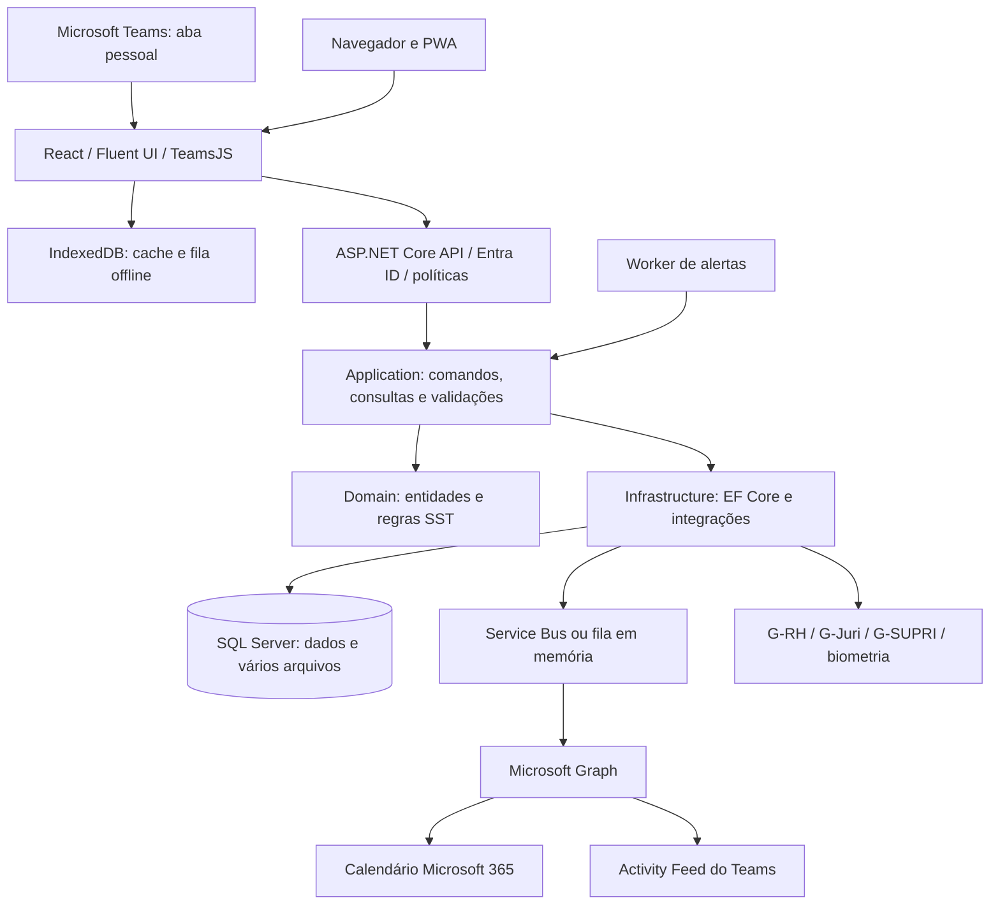
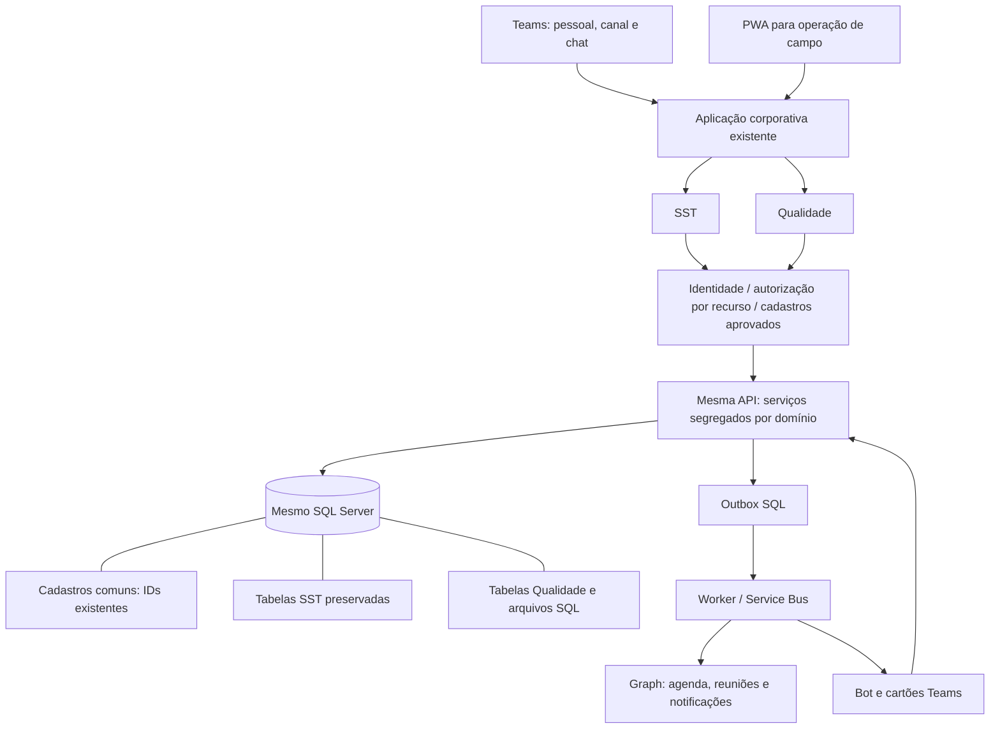

# SST + Qualidade — auditoria técnica e plano de integração

Data de referência: 30/09/2026 — America/Sao_Paulo.

**Resultado:** é tecnicamente viável introduzir Qualidade no mesmo aplicativo, API e banco SQL Server do SST. A recomendação é preservar a aplicação existente, acrescentar um domínio próprio de Qualidade e compartilhar cadastros por identificadores, conforme as regras de negócio que forem decididas. O armazenamento inicial deve acompanhar a implementação real: dados e arquivos binários no SQL, com acesso pela API.

**Situação desta entrega:** Fase 0 executada: auditoria do código local, verificações automatizadas e proposta técnica. Este documento não representa funcionalidades implantadas. Não foram alterados código de aplicação, migrations, permissões Microsoft ou dados operacionais. O prompt solicitado determina: “Somente após essa análise aguarde autorização para iniciar alterações estruturais.”

Fonte dos requisitos: [conversa compartilhada](https://chatgpt.com/share/6abdb1a0-56c8-83e9-b25c-e4ebdb020300?ogimg=plain) e pedido nesta conversa: seguir o armazenamento existente, avaliar o mesmo banco e integrar aplicativo, calendário e demais fluxos ao Teams. Os nomes de novas entidades e contratos técnicos propostos abaixo são decisões de arquitetura sugeridas, não requisitos literais da Base de Conhecimento do SST.

## 1. Escopo e evidência

- Diretório auditado: `C:\Projetos\SST-APP`; branch `master`; HEAD `943336d`.
- O checkout já continha alterações de PT, DDS, API, configuração local e arquivos não versionados antes da auditoria. As verificações refletem esse checkout, não apenas o commit HEAD.
- Foram examinados regras, onboarding, projetos, entidades, EF, migrations, autenticação, autorização, sincronização, arquivos, UI, Graph, filas, worker, testes e workflows.
- Foram consultados o histórico recente de todas as branches e os worktrees existentes. Há trabalho separado de uniformes, biometria e responsividade; uma futura implementação deve reconciliar a base antes de criar branch.
- Não houve conexão deliberada ao banco operacional, execução da aplicação, envio de mensagens/convites, criação de recursos Azure ou deploy. A API aplica migrations e seeders no startup, motivo para não iniciá-la apenas para esta inspeção.
- O ambiente Microsoft efetivamente publicado, licenças, consentimentos, recursos, backups e conteúdo do banco não foram inspecionados. “Existe no código” não significa “validado no tenant”. A auditoria é técnica e estática, acompanhada dos testes descritos na seção 10; não é um teste de invasão nem uma homologação ponta a ponta.

## 2. Arquitetura encontrada

| Camada | Implementação confirmada | Consequência para Qualidade |
| --- | --- | --- |
| Frontend | React 19, TypeScript 6, Vite 8, Fluent UI 9, React Router 7 com HashRouter | Acrescentar rotas e navegação do módulo, mantendo os componentes existentes |
| Teams e identidade | TeamsJS 2, MSAL Browser 5, Microsoft.Identity.Web | Reutilizar SSO e identidade corporativa |
| Backend | .NET 8 / ASP.NET Core; projetos Domain, Application, Infrastructure, Api e Worker | Manter a divisão atual, com fatias verticais de Qualidade |
| Casos de uso | MediatR 14, FluentValidation 12, AutoMapper 16 | Comandos/consultas próprios, com validações e autorização de recursos |
| Banco | EF Core 8.0.11 e provider SQL Server; conexão `SstDatabase` | Um banco e um contexto inicial, com migrations incrementais por módulo |
| Offline | Dexie 4 / IndexedDB e vite-plugin-pwa | Base disponível, mas precisa das correções da seção 7 |
| Relatórios | QuestPDF e QRCoder | Reutilizar geração, cabeçalho, rodapé, numeração e validação |
| Integrações | HTTP para Graph; Azure.Identity; Azure Service Bus | Reutilizar adaptadores e filas, completar durabilidade e funcionalidades |
| Infraestrutura declarada | Docker, nginx, Azure Container Apps, ACR, GitHub Actions | Expandir o produto no mesmo padrão de publicação |

As versões são as declaradas nos arquivos de projeto/package.json, não uma recomendação de atualização. A camada Application referencia EF Core diretamente; trata-se do padrão real adotado, embora o onboarding descreva uma separação mais estrita.

Fontes: [package.json](C:/Projetos/SST-APP/src/AAHBRANT.SST.TeamsApp/package.json), [Application.csproj](C:/Projetos/SST-APP/src/AAHBRANT.SST.Application/AAHBRANT.SST.Application.csproj), [Infrastructure.csproj](C:/Projetos/SST-APP/src/AAHBRANT.SST.Infrastructure/AAHBRANT.SST.Infrastructure.csproj), [Program da API](C:/Projetos/SST-APP/src/AAHBRANT.SST.Api/Program.cs), [injeção de infraestrutura](C:/Projetos/SST-APP/src/AAHBRANT.SST.Infrastructure/DependencyInjection.cs).

## 3. Banco e entidades: o que pode ser compartilhado

| Entidade atual | Significado verificado | Tratamento recomendado |
| --- | --- | --- |
| `Usuario`, `PerfilAcesso`, `Permissao`, `UsuarioPerfilObra` | Identidade, perfis e vínculos de obra | Reutilizar identidade; acrescentar permissões de Qualidade sem concedê-las automaticamente |
| `Obra` | Cadastro operacional central; não possui `EmpresaId`/`ContratoId` | Reutilizar o mesmo ID de obra; decidir separadamente a hierarquia corporativa |
| `Setor`, `Equipe`, `Funcao` | Setor pertence à obra; equipe pertence ao setor | Candidatos a cadastro comum, conforme a semântica operacional aprovada |
| `Trabalhador` | Pessoa operacional com dados SST, saúde, biometria e vínculos | Reutilizar referências necessárias; expor à Qualidade somente os campos autorizados |
| `Empresa`, `Contrato` | Cadastro de terceirizados; contrato vincula empresa e uma obra, com identificador G-Juri obrigatório | Não interpretar automaticamente como empresa proprietária e contrato principal da obra |
| `AreaSst`, `Atividade` | Área com riscos/requisitos SST; atividade associada à obra e riscos | Avaliar reaproveitamento; frente/trecho/serviço de Qualidade pode exigir extensão ou entidade própria |
| `ChecklistModelo`, `Inspecao` | Checklists versionados e inspeções com tipos/regras SST | Reaproveitar padrões e serviços; evitar misturar execuções de Qualidade nas consultas SST existentes |
| `NaoConformidade` | NC do SST, sem `ObraId` direto e sem histórico completo de transições | Não reutilizar como NC de Qualidade sem resolver escopo e modelo de histórico |
| `AcaoPlano` | Plano genérico com `OrigemTipo/OrigemId`; sem obra/módulo explícitos | Candidato a serviço comum após reforçar escopo e autorização da origem |
| `Alerta`, `RegraAlerta`, `CalendarioEventoTeams` | Alertas e rastreamento do evento Graph por origem | Expandir com origens Qualidade, preservando as SST |
| `Evidencia` | Metadados polimórficos com `BlobUrl`; fluxo genérico de armazenamento não encontrado | Não tratar como serviço de upload pronto |
| `TrilhaAuditoria`, `DocumentoAssinatura`, `ContadorDocumento` | Auditoria, assinaturas e numeração | Reutilizar serviços com novos tipos, escopo e testes |

**Diferença relevante frente ao planejamento do chat:** a cadeia Organização → Empresa → Contrato → Obra não está modelada dessa forma. Hoje `Contrato` aponta para `Empresa` e `Obra`, e nasceu para contratação de terceiros. Uma mudança de significado afetaria integração e dados existentes. A definição do contrato principal, das empresas operadoras e do que será compartilhado permanece uma decisão futura do negócio, conforme solicitado.

O código atual não tem um módulo de gestão da Qualidade, ensaios de pavimentação ou documentos versionados de Qualidade. A antiga `DocumentoGestao` citada no onboarding deixou de integrar o modelo atual; a migration `20260903135544_ReformularPcmsoSemDocumentoGestao` e a entidade atual de PCMSO mostram a evolução. Não assumir que o antigo módulo documental está disponível para reaproveitamento integral.

Fontes: [contexto EF](C:/Projetos/SST-APP/src/AAHBRANT.SST.Infrastructure/Persistencia/SstDbContext.cs), [terceirizados](C:/Projetos/SST-APP/src/AAHBRANT.SST.Domain/Entidades/Terceirizado.cs), [Obra](C:/Projetos/SST-APP/src/AAHBRANT.SST.Domain/Entidades/Obra.cs), [acesso](C:/Projetos/SST-APP/src/AAHBRANT.SST.Domain/Entidades/PerfilAcesso.cs), [NC](C:/Projetos/SST-APP/src/AAHBRANT.SST.Domain/Entidades/NaoConformidades/NaoConformidade.cs), [plano de ação](C:/Projetos/SST-APP/src/AAHBRANT.SST.Domain/Entidades/AcaoPlano.cs).

## 4. Armazenamento e decisão recomendada

**Banco:** manter `SstDatabase` e SQL Server. Acrescentar tabelas `Qualidade...` e namespaces próprios, com FKs para os cadastros comuns aprovados. Preservar nomes/tabelas SST. A separação lógica inicial por tabelas e serviços é suficiente; não é necessário mover todas as tabelas existentes para novos schemas nem renomear a solução.

**Arquivos:** fotos de inspeções, DDS, assinaturas, certificados e documentos PGR/PCMSO utilizam `byte[]` persistido no SQL. A infraestrutura não registra um cliente Blob Storage. Há validações de tamanho e assinatura binária de arquivo em fluxos existentes. `Evidencia.BlobUrl` sozinho não comprova armazenamento externo funcional.

Para Qualidade, propor armazenamento SQL em tabela de conteúdo separada dos metadados, respeitando o padrão existente. Isso permite consultar listas e dashboards sem carregar fotos/PDFs. Campos propostos: ID, obra, entidade de origem, nome, MIME validado, tamanho, hash SHA-256, autor, data, versão e conteúdo. A autorização de download deve validar módulo, obra e registro de origem; URLs públicas não são o padrão proposto.

Introduzir uma interface de armazenamento com implementação SQL permite migrar conteúdos futuramente para Blob caso volume, desempenho e custo justifiquem. Essa migração seria um projeto próprio, com verificação de hash e compatibilidade; não faz parte da adoção inicial do módulo.

**Compartilhamento futuro:** usar IDs comuns não concede leitura de todos os dados. Recomenda-se negar exposição entre módulos por padrão e aprovar, por caso de uso, campos, finalidade, público e escopo. Relatórios integrados deverão consumir projeções autorizadas, não consultar indiscriminadamente todas as tabelas. Dados clínicos e biométricos não entram em relatórios de Qualidade apenas por estarem no mesmo banco.

Alternativa avaliada: banco independente para Qualidade. Oferece isolamento operacional mais forte, mas exigiria sincronização de cadastros, duplicação de referências e tratamento de inconsistências. Para a estrutura encontrada e o pedido atual, o mesmo banco com autorização explícita tem menor custo de integração. A aprovação depende de resolver as lacunas de acesso antes de liberar usuários de Qualidade.

Fontes: [inspeções e fotos](C:/Projetos/SST-APP/src/AAHBRANT.SST.Domain/Entidades/Inspecoes/Inspecao.cs), [evidências](C:/Projetos/SST-APP/src/AAHBRANT.SST.Domain/Entidades/Evidencia.cs), [validação de documento](C:/Projetos/SST-APP/src/AAHBRANT.SST.Application/Pgrs/Commands/AnexarDocumentoPgrCommand.cs).

## 5. Autenticação, permissões e isolamento

O frontend obtém token pelo Teams e usa MSAL no navegador. A API usa Entra ID quando `AzureAd:TenantId` está configurado. Perfis e permissões vêm do banco. O middleware calcula obras acessíveis e o EF aplica filtros a diversas entidades.

Lacunas verificadas que impedem considerar o modelo pronto para novos públicos:

1. **Permissão e obra são avaliadas separadamente.** `PermissaoAuthorizationHandler` aceita uma permissão existente em qualquer perfil do usuário; `EscopoPorObraMiddleware` reúne obras de todos os vínculos. Um usuário que pode editar na obra A e apenas consultar na B pode passar na política de edição e no filtro da B. A autorização nova precisa avaliar a mesma combinação de usuário, ação, módulo e obra.
2. **Cobertura de recursos incompleta.** NC e plano de ação têm somente filtro de ativo em suas configurações. A consulta de NC aplica obra apenas quando o parâmetro é enviado. Campos polimórficos exigem validação explícita de origem; filtro em uma entidade pai não protege automaticamente todo acesso direto ao filho.
3. **Configuração ausente libera políticas.** O handler e o middleware desabilitam restrições quando falta TenantId, sem limitar esse comportamento ao ambiente Development. Homologação/produção devem falhar no startup quando a configuração obrigatória estiver incompleta.
4. **Banco compartilhado não equivale a multiempresa.** Empresa/Contrato são cadastros do domínio de terceirizados; não há isolamento corporativo uniforme por organização/empresa em todo o modelo.

Proposta: centralizar autorização por recurso e aplicá-la em consultas, comandos, anexos, exportações, dashboard, sync e ações do Teams. Acrescentar permissões como `qualidade-inspecao:ver/criar/editar/concluir`, `qualidade-nc:tratar/validar`, `qualidade-documento:aprovar`, com concessões deliberadas. Os códigos são exemplos técnicos; a matriz de perfis será definida com o negócio.

Fonte: [handler de políticas](C:/Projetos/SST-APP/src/AAHBRANT.SST.Api/Autorizacao/PermissaoAuthorizationHandler.cs), [escopo de obra](C:/Projetos/SST-APP/src/AAHBRANT.SST.Api/Middlewares/EscopoPorObraMiddleware.cs), [consulta NC](C:/Projetos/SST-APP/src/AAHBRANT.SST.Application/NaoConformidades/Queries/ListarNaoConformidadesQuery.cs).

## 6. Teams e calendário: integração completa como escopo verificável

| Capacidade | Situação encontrada | Trabalho proposto / critério de conclusão |
| --- | --- | --- |
| Aba pessoal e SSO | Manifesto, SDK e aquisição de token presentes | SST e Qualidade acessíveis segundo permissões; sessão testada no cliente Teams |
| Aba por canal/chat | Manifesto aponta `#/config`; rota e chamadas `pages.config` não encontradas no frontend | Implementar configuração de obra/módulo, salvar contexto e revalidá-lo na API |
| Calendário dentro do app | Endpoint pessoal combina Graph e vencimentos SST | Manter agenda pessoal e adicionar registros autorizados de Qualidade |
| Vencimentos na agenda Microsoft | Serviço cria/atualiza/remove eventos de dia inteiro; rastreia GraphEventId | Cobrir inspeções, ações, validações e documentos; reagendamento e conclusão atualizam o evento correto |
| Compromissos e reuniões | Escrita atual não tem horários, convidados nem criação de reunião online | Acrescentar início/fim, fuso, organizador, participantes e link de reunião quando necessário |
| Notificações no Teams | Graph Activity Feed com `alertaSst` | Tipos Qualidade, destinatários autorizados, links diretos e prevenção de duplicatas |
| Cartões e aprovações | Não encontrado bot nem processamento de Adaptive Cards | Implementar envio/atualização de cartões e backend de ações autenticadas, com auditoria e concorrência |
| Alteração feita no calendário | Consulta Graph existe; não encontrada reconciliação de mudanças para o domínio | Definir fonte de verdade e reconciliar edições/cancelamentos sem alterar registros críticos silenciosamente |
| Temas/acessibilidade | Tema claro/escuro próprio; sem handler de troca de tema do Teams encontrado | Integrar tema do host, alto contraste, teclado e clientes desktop/web/mobile |

O manifesto declara abas de canal, mas essa declaração não constitui uma implementação de configuração. A Microsoft descreve o uso de `pages.config.setConfig`, callback de salvamento e `websiteUrl` para clientes mobile. [Documentação de configuração](https://learn.microsoft.com/en-us/microsoftteams/platform/tabs/how-to/create-tab-pages/configuration-page).

O calendário deve continuar no Microsoft 365 via Graph. Reuniões podem ser criadas como eventos com `isOnlineMeeting=true` e `onlineMeetingProvider=teamsForBusiness`, quando a conta suportar. Convites são enviados ao incluir participantes; os destinatários precisam ser explícitos no fluxo de agendamento. Usar `transactionId` estável para reduzir duplicação após falha de resposta. [Criação de eventos](https://learn.microsoft.com/en-us/graph/api/user-post-events?view=graph-rest-1.0).

**Correções técnicas do calendário atual:** a leitura usa `$top=250` sem consumir `@odata.nextLink`. As fronteiras são enviadas sem offset; a API Graph interpreta isso como UTC, mesmo com o header de apresentação `America/Sao_Paulo`. Paginação e limites com offset precisam ser corrigidos e testados, especialmente em eventos próximos da meia-noite. [Contrato de calendarView](https://learn.microsoft.com/en-us/graph/api/calendar-list-calendarview?view=graph-rest-1.0).

O rastreamento local trata reentrega após sucesso registrado, mas há janela entre criar no Graph e salvar no SQL. Falha nessa janela pode duplicar evento. Além disso, falhas de atualização/cancelamento mudam o registro para `Falhou`, enquanto o handler só executa essas operações quando o status é `Criado`; a reentrega pode ser ignorada. O fluxo deverá separar estado desejado, estado remoto e falha de processamento, manter a operação pendente e reconciliar por identificador estável.

Para notificações, avaliar a permissão RSC `TeamsActivity.Send.User` por instalação, em vez de ampliar acesso global sem necessidade. O manifesto e a instalação do app fazem parte da configuração. [Activity Feed](https://learn.microsoft.com/en-us/graph/teams-send-activityfeednotifications). Para acesso de aplicação ao calendário, avaliar escopo por caixas autorizadas usando Exchange Application RBAC; permissões amplas já concedidas no Entra podem somar acesso e precisam ser consideradas na análise. [Application RBAC](https://learn.microsoft.com/en-us/exchange/permissions-exo/application-rbac).

As aprovações em cartões precisarão de um backend de bot/ações: Universal Actions usa `Action.Execute` com esse processamento. A ação deve executar a mesma regra de negócio que a tela, validar o usuário e retornar o estado atualizado; o cartão não pode conceder permissão por conta própria. [Universal Actions](https://learn.microsoft.com/en-us/microsoftteams/platform/task-modules-and-cards/cards/universal-actions-for-adaptive-cards/overview).

A integração será considerada concluída somente após testes reais no tenant de homologação: instalação, SSO, contexto de canal, agenda, reenvio, reagendamento, convite, notificações, cartões e negação de ações sem permissão. Nenhuma dessas ações externas foi executada nesta auditoria.

Fontes locais: [manifesto](C:/Projetos/SST-APP/src/AAHBRANT.SST.TeamsApp/manifest/manifest.json), [rotas](C:/Projetos/SST-APP/src/AAHBRANT.SST.TeamsApp/src/App.tsx), [calendário Graph](C:/Projetos/SST-APP/src/AAHBRANT.SST.Infrastructure/Integracao/Teams/GraphCalendarioTeamsService.cs), [processamento da fila](C:/Projetos/SST-APP/src/AAHBRANT.SST.Infrastructure/Integracao/Bot/CalendarioTeamsMensagemHandler.cs), [notificações](C:/Projetos/SST-APP/src/AAHBRANT.SST.Infrastructure/Integracao/Teams/GraphActivityNotificacaoTeamsService.cs).

## 7. Offline e sincronização

O piloto existente atende DDS, inspeções, checklists e APRs. Há cache JSON/blob, fila de mutações, reenvio, indicador de estado, armazenamento de conflitos e middleware de idempotência. A leitura efetiva tenta a rede primeiro e usa o cache em falha de rede, apesar do comentário “cache-then-network”.

Lacunas prioritárias:

- **Isolamento local:** IndexedDB tem nome fixo e cache indexado por URL, sem usuário/tenant na chave. Itens da fila não guardam identidade de origem; o reenvio usa o token da sessão corrente. Troca de conta no mesmo perfil de navegador exige bloqueio/particionamento para não mostrar ou reenviar dados de outra pessoa.
- **Criação offline:** novos registros não ganham ID local utilizável para seus filhos. Para iniciar inspeção e anexar respostas/fotos sem rede, será necessário ID do cliente, ordem de dependências e reconciliação.
- **Conflitos e fotos:** em 409, o item é removido da fila; para multipart, o registro do conflito guarda apenas a indicação textual do upload, não seus blobs. Após cinco respostas 4xx também há remoção da fila. Conservar evidência original e permitir recuperação; 401/403 devem pausar a operação e pedir reautenticação/revisão de acesso.
- **Idempotência no servidor:** a busca usa somente a chave global, não usuário, rota, método e hash de corpo. A gravação da resposta ocorre depois do handler, fora de uma garantia transacional comum. Chamadas concorrentes e falha entre gravações precisam de tratamento; DELETE não passa por esse middleware.
- **Concorrência:** RowVersion está configurado no EF, mas comandos examinados, como responder item de inspeção, não recebem a versão que o cliente leu. A versão carregada no instante do replay não detecta por si só uma alteração anterior feita enquanto o dispositivo estava offline.
- **Host Teams:** o service worker do projeto descreve suporte standalone/PWA. Não há comprovação de funcionamento offline completo dentro de todos os clientes Teams. Homologar a matriz de clientes e disponibilizar a PWA para o cenário de campo compatível.

Proposta: particionar cache/fila por identidade e ambiente; guardar dono, ID, versão, dependências, tentativas e erros; definir validade offline; usar estados pendente/enviando/sincronizado/erro/conflito sem descartar evidência; preservar rascunhos em atualizações do app. Reautorização é obrigatória no servidor ao sincronizar. As regras devem estar prontas antes de vender o fluxo de inspeção Qualidade como offline completo.

Fontes: [banco local](C:/Projetos/SST-APP/src/AAHBRANT.SST.TeamsApp/src/lib/offline/db.ts), [sincronização](C:/Projetos/SST-APP/src/AAHBRANT.SST.TeamsApp/src/lib/offline/syncEngine.ts), [idempotência](C:/Projetos/SST-APP/src/AAHBRANT.SST.Api/Middlewares/IdempotenciaMiddleware.cs), [resposta de inspeção](C:/Projetos/SST-APP/src/AAHBRANT.SST.Application/Inspecoes/Commands/ResponderItemInspecaoCommand.cs), [PWA](C:/Projetos/SST-APP/src/AAHBRANT.SST.TeamsApp/vite.config.ts).

## 8. Auditoria, segurança, arquivos e observabilidade

Há validação de comandos, queries com projeção, criptografia específica de CPF e template biométrico, soft-delete, RowVersion, trilha de assinatura e tratamento global de exceções. Isso é reaproveitável, com revisão dos limites abaixo.

- `SstDbContext.AplicarAuditoria` atualiza datas e converte exclusão em desativação; não registra automaticamente antes/depois/autor de toda alteração.
- NC guarda apenas o último motivo de devolução. Qualidade precisa de histórico imutável de transições, prazos, responsáveis, evidências e validações.
- A cadeia de hash da `TrilhaAuditoria` lê o último registro sem serialização; concorrência pode bifurcar a cadeia. Comentários sobre append-only ou temporalidade não substituem verificação de permissões SQL e schema real.
- O tratamento de conflito monta resposta a partir das propriedades da entidade; deverá retornar DTO permitido para evitar exposição de campos internos/binários. Algumas exceções Graph são repassadas como mensagem à UI: sanitizar detalhes remotos.
- Arquivos novos precisam validar conteúdo/MIME/tamanho, integridade, autorização e vínculo à obra. Definir limites e política de retenção com o negócio; não inventar prazo universal.
- Filas em memória são fallback de desenvolvimento e perdem mensagens ao reiniciar. Para entrega durável, propor outbox SQL na transação de negócio, consumidores idempotentes, Service Bus e rastreamento de falhas/reprocessamento.
- Registrar correlação de operação, registro, módulo, obra, usuário e estado de sincronização/Graph, com métricas de atraso e falha. Não registrar tokens, conteúdo clínico, biometria ou arquivos em logs.

Fontes: [auditoria](C:/Projetos/SST-APP/src/AAHBRANT.SST.Infrastructure/Auditoria/AuditoriaService.cs), [tratamento de erros](C:/Projetos/SST-APP/src/AAHBRANT.SST.Api/Middlewares/TratamentoDeExcecaoMiddleware.cs), [composição dos serviços](C:/Projetos/SST-APP/src/AAHBRANT.SST.Infrastructure/DependencyInjection.cs).

## 9. Deploy, migrations e dívida técnica

O workflow de deploy constrói API, Worker e Web no ACR e atualiza Container Apps de homologação ao receber mudanças em `master` ou execução manual. O CI separado compila, testa, verifica migrations e constrói frontend. **O YAML de deploy não depende do sucesso do workflow CI**; proteções externas de branch não foram verificadas.

A API aplica `MigrateAsync()` e seeders ao iniciar. Antes de evoluir banco compartilhado, separar a aplicação controlada de migrations do startup, ou formalizar exclusão mútua e compatibilidade entre revisões. Usar migrações aditivas primeiro, backfill revisável, manutenção de contratos antigos e rollback de aplicação compatível. Testar restauração de backup antes de qualquer alteração destrutiva futura.

A documentação tem trechos desatualizados: App Service/Cosmos/Blob, módulo documental, biometria simulada, configuração antiga de PCMSO e lacunas de filtros já parcialmente corrigidas. A arquitetura recomendada se baseia no código atual. Preservar o histórico documental, acrescentando documentação datada em vez de assumir todos os relatos antigos como estado presente.

Fontes: [CI](C:/Projetos/SST-APP/.github/workflows/ci.yml), [deploy](C:/Projetos/SST-APP/.github/workflows/deploy.yml), [startup](C:/Projetos/SST-APP/src/AAHBRANT.SST.Api/Program.cs), [onboarding](C:/Projetos/SST-APP/ONBOARDING.md).

## 10. Verificações executadas

Ambiente local: SDK .NET 8.0.424, Node 24.19.0. A ferramenta global EF era 10.0.11; para evitar trocar a instalação global, foi instalada uma cópia EF 8.0.11 na pasta ignorada `.codex-artifacts/qualidade-auditoria-2026-09-30/tools`.

| Verificação | Resultado |
| --- | --- |
| `dotnet test SST-APP.sln --no-restore --verbosity quiet` | Compilação permitiu executar as cinco suítes; **629 testes: 627 aprovados, 2 falhas, 0 ignorados** |
| AgenteBiometria | 28 aprovados |
| Domain | 7 aprovados |
| Infrastructure | 86 aprovados |
| Api.IntegrationTests | 11 aprovados |
| Application | 495 aprovados; 2 falhas; 497 no total |
| `npm run build` | Falhou no TypeScript, antes do Vite, por TS2322 em `PermissaoTrabalhoDetalhePage.tsx:230`: `tom="atencao"` não pertence aos valores aceitos pelo componente |
| EF 8.0.11 `migrations has-pending-model-changes --no-build` | Aprovado: modelo corresponde ao snapshot da última migration; sem aplicar migrations |

As duas falhas de Application ocorreram na preparação do banco SQLite: `no such collation sequence: Latin1_General_100_BIN2`. Testes:

1. `AlojamentoEntidadeTests.SaveChanges_DoisVinculosAtivosParaMesmoTrabalhador_LancaExcecaoDeConstraint`.
2. `ObterOuCriarInspecaoAlojamentoCommandHandlerTests.Handle_CorridaConcorrenteNoBanco_RecuperaERetornaInspecaoVencedoraSemPropagarExcecao`.

Isso não demonstra falha dessas regras no SQL Server; demonstra que esses testes não chegaram a exercê-las. Corrigir compatibilidade do fixture e validar constraints/concorrência no provider real antes da expansão.

O EF emitiu avisos sobre filtros em relações obrigatórias (`CalendarioEventoTeams`, `EstoqueEpc`, `InstalacaoEpc`, `ParticipanteSessaoTreinamento`, `SessaoTreinamento`) e valor default/sentinel de `Usuario.Status`. A checagem de modelo usou ambiente de auditoria e configuração descartável; **não valida a versão física do banco implantado**.

O projeto denominado IntegrationTests contém principalmente testes locais de filas/dados e também um teste vazio; seu nome não comprova cobertura HTTP autenticada nem integração real Graph. Domain também mantém um teste vazio. Não foram executados E2E no Teams, SQL operacional ou chamadas Graph. Não há aprovação de build frontend nesta entrega.

O arquivo TRX final em `.codex-artifacts/qualidade-auditoria-2026-09-30/testes/auditoria.trx` contém a suíte Application, pois o nome fixo foi sobrescrito pelas suítes. Os totais acima foram consolidados das saídas individuais da execução; não devem ser atribuídos a esse único TRX.

## 11. Arquitetura proposta

Reutilizar `SstDbContext` inicialmente é a menor intervenção compatível com a solução. Manter serviços de Qualidade separados, endpoints `/api/qualidade/...` e rotas `#/qualidade/...`. Separar projetos/DbContexts futuramente somente se houver motivo operacional; a modularidade deve vir primeiro dos limites de regras, dados e permissões.

| Reutilizar | Alterar/fortalecer | Criar |
| --- | --- | --- |
| SSO, identidade, cadastros autorizados, componentes `@ui`, tema, PDF, numeração, API e SQL | Autorização ação+obra+módulo; particionamento offline; idempotência; conflitos; histórico; entrega durável; integração Teams | Domínio Qualidade, telas, contratos de API, modelos/execuções, ensaios, documentos e versões |
| Alertas, Graph e rastreamento de eventos | Paginação/fuso, estado de retry, horários/reuniões, deep links e reconciliação | Configuração de abas de canal, cartões de aprovação e processamento de ações |
| Padrão SQL de arquivos | Metadados, segregação de conteúdo, acesso, tamanho/hash e recuperação offline | Armazenamento de anexos Qualidade com implementação SQL |

O design system já exporta componentes de formulário, lista, seleção, status, feedback, KPI e workflow. As novas páginas devem consumir `@ui`, seguindo o padrão vigente e preservando as decisões visuais atuais. Fonte: [exportações da UI](C:/Projetos/SST-APP/src/AAHBRANT.SST.TeamsApp/src/ui/index.ts).

## 12. Modelo funcional proposto para Qualidade

Entidades abaixo são propostas, não tabelas criadas:

| Conjunto | Responsabilidade e vínculos |
| --- | --- |
| `QualidadeModeloInspecao`, versões, seções e itens | Checklist configurável por serviço; revisão publicada imutável |
| `QualidadeInspecao`, respostas | Obra obrigatória, versão do modelo, responsável, contexto local/serviço e versão de concorrência |
| `QualidadeNaoConformidade`, histórico | Origem tipada e rastreável, obra, requisito, gravidade, responsável, prazo, causa e validação |
| Ações | Avaliar extensão de `AcaoPlano` após escopo seguro; caso não preserve o domínio, usar entidade própria sem duplicar identidades |
| `QualidadeTipoEnsaio`, especificação versionada, amostra, ensaio e resultado | Grandezas/unidades/limites configurados por requisito técnico aprovado; referência à obra/lote/serviço |
| `QualidadeDocumento`, revisão | Publicação, aprovação, validade e vínculo ao arquivo; manter versões anteriores |
| `QualidadeAnexo`, conteúdo | Fotos, PDFs e outros arquivos aprovados; SQL, hash e vínculo ao registro/obra |
| Contexto operacional | Frente/trecho/local e serviço, após confirmar equivalência com entidades existentes |

Fluxo proposto de NC: aberta → análise → plano de ação → tratamento → aguardando validação → encerrada; rejeição retorna para tratamento com motivo e histórico. Transições devem exigir permissão e evidência conforme regra. Uma falha em item poderá gerar NC idempotente quando o modelo assim definir.

Dashboard e relatórios usarão o mesmo filtro de obra/período/serviço/status aplicado às listagens. Cada indicador deverá abrir os registros que o compõem. Fórmulas de conformidade, prazo e reincidência serão documentadas; não usar números de demonstração como dados reais.

IA permanece assistiva: sugestões de texto, causas e ações revisadas pelo usuário; busca e relatórios respeitam os mesmos escopos. Não há autorização neste desenho para envio automático de dados clínicos/biométricos a um serviço de IA.

## 13. Ordem de implementação e critérios de aceite

| Fase | Entrega concreta | Critérios principais |
| --- | --- | --- |
| 0 — esta entrega | Auditoria, evidências e arquitetura | Documento disponível; limites e problemas registrados |
| 1 — base compartilhada | Reconciliar branch/WIP, corrigir validações atuais, autorização por recurso, entrada Qualidade no Teams e configuração de canal | Build/testes verdes; usuário sem Qualidade bloqueado; permissão na obra A não se estende à B; SST preservado; nenhuma nova concessão automática |
| 2 — inspeção de campo | Modelo versionado, execução, armazenamento SQL de evidências, rascunho e sincronização | Criar offline, responder, anexar, retomar e sincronizar uma vez; troca de conta isolada; conflito preserva dados |
| 3 — NC e ações | Fluxo de NC, tratamento, validação, histórico e alertas/calendário para prazos | Ciclo completo incluindo devolução; obra obrigatória e anexos autorizados; evento acompanha alteração de prazo |
| 4 — integração completa Teams | Reuniões/convites, notificações, cartões, ações e reconciliação | Homologação real pessoal/canal/chat; não duplicar eventos; processar falha/retry; usuário sem permissão não aprova pelo cartão |
| 5 — ensaios e documentos | Amostras/resultados, especificações e versões documentais | Cálculos aprovados pelo negócio, NC por resultado, revisão vigente e histórico preservado |
| 6 — gestão e IA | Indicadores, relatórios, busca e assistência | Totais conciliados, exportação autorizada, sugestões revisadas e dados minimizados |
| 7 — publicação gradual | Migração controlada, observabilidade, treinamento, rollback e homologação | Compatibilidade SST, testes reais SQL/Teams, restauração validada e operação acompanhada |

A ordem traz isolamento, idempotência e rascunhos offline para o início, porque eles sustentam os fluxos de campo. A integração Teams começa na Fase 1, ganha eventos operacionais na Fase 3 e é concluída funcionalmente na Fase 4; não é um complemento opcional.

Testes de aceitação transversais: permissões por módulo/obra e usuário inativo; acesso direto por ID; enumeração/listas/exportação; anexos; versões concorrentes; envio duplicado; queda após gravação; token expirado; troca de conta; perda durante upload; retenção de rascunhos; falha Graph; 429/retentativa; timezone/paginação; alteração de responsável; cartão antigo; regressão SST.

## 14. Decisões reservadas para a implementação

O pedido atual já define Teams, calendário, preservação do padrão de armazenamento e preferência pelo mesmo banco. Não é necessário reabrir essas preferências.

Permanecem para definição posterior: campos exatos compartilhados, conceito de empresa proprietária/contrato principal, equivalência de frente/local/atividade, matriz de perfis, quem recebe convites/cartões e em quais canais, regras para edições feitas diretamente no calendário, retenção de documentos e critérios técnicos dos ensaios. Essas decisões não impedem concluir a auditoria.

**Próxima alteração estrutural proposta para autorização:** Fase 1, em branch própria baseada no estado reconciliado: fundamento modular e autorização por recurso, preparação da entrada Qualidade e configuração Teams. As correções do checkout deverão preservar os trabalhos existentes. Não inclui publicar em produção, aplicar migrations no banco operacional nem conceder permissões Microsoft sem verificar a configuração e o escopo concreto.

## 15. Matriz de cobertura do prompt

| Item solicitado | Seção |
| --- | --- |
| Arquitetura, stack, frontend/backend | 2 |
| Banco, entidades e reutilização | 3 e 4 |
| Autenticação e permissões | 5 |
| Integrações, Teams e calendário | 6 |
| Offline/sincronização | 7 |
| Arquivos, auditoria e segurança | 4 e 8 |
| Deploy, dívida técnica e riscos | 5 a 9 |
| Testes e limites da validação | 10 |
| Componentes reutilizáveis e arquitetura proposta | 11 |
| Introdução de Qualidade preservando SST | 11 e 12 |
| Plano técnico, ordem e decisões | 13 e 14 |

